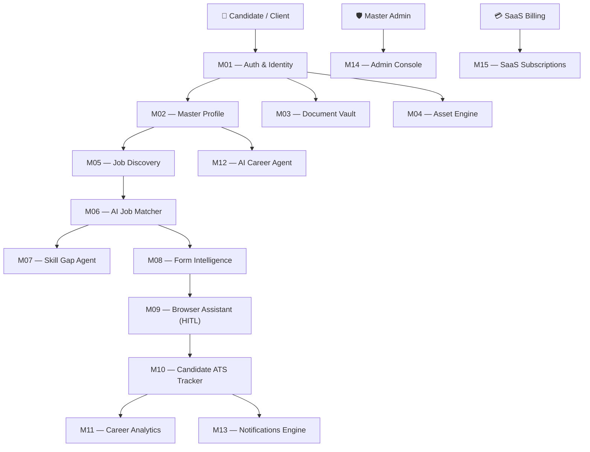

# ApplyPilot AI — Enterprise Career & Job Automation OS
## Master Project Documentation & Client Handover Guide

> [!IMPORTANT]
> **CONFIDENTIAL & PROPRIETARY**  
> This master technical documentation provides a complete functional, architectural, and operational overview of **ApplyPilot AI**. Prepared by the Virtual MNC Engineering Team for Product Owner **Banti** and prospective enterprise clients.

---

## 📋 Executive Summary

**ApplyPilot AI** is an enterprise-grade, multi-tenant **AI Career Operating System & Automated Job Application Platform**. It merges modern artificial intelligence, document vault security, multi-source job scraping (SSC/UPSC Government exams & Tech MNCs), automated form fill with Human-In-The-Loop (HITL) safety, and SaaS monetization into a unified web application.

- **Framework**: Next.js 14 (App Router) with TypeScript & React 18
- **Styling & Theme**: Ultra-Luxury Space Navy Glassmorphic Design (`#0b0f19` theme)
- **Database**: Dual Architecture — MongoDB (Mongoose) with automatic In-Memory Dev Engine Fallback
- **Browser Automation**: Chrome Extension Manifest V3 Package (`src/modules/m09-browser-assistant/extension`)
- **Automated Tests**: 64 Unit & E2E Vitest Test Suites (100% Pass Rate)

---

## 🏛️ System Architecture & 15 Core Modules

ApplyPilot AI is built upon a modular 15-domain architecture (`src/modules/m01` through `src/modules/m15`). Each module operates independently with dedicated Zod validation schemas, Mongoose models, service layers, and Vitest test suites.



---

### Module-by-Module Functional Matrix

| Module | Feature Area | Key Functionality | Production Endpoint |
|---|---|---|---|
| **M01** | **Identity & Access** | JWT Cookie Authentication, Bcrypt Password Hashing, Session Protection | `/login`, `/register`, `/api/v1/auth/*` |
| **M02** | **Master Candidate Profile** | Single Source of Truth for Candidate Data, Profile Completeness Index (PCI) Score | `/dashboard/profile`, `/api/v1/profile` |
| **M03** | **Document Vault** | AES-256 Encrypted Document Storage, PDF Resume Metadata Parsing | `/dashboard/vault`, `/api/v1/documents/*` |
| **M04** | **Asset Processing Engine** | SSC/UPSC Photo & Signature Resizer (20KB - 50KB JPG Conversion) | `/dashboard/assets`, `/api/v1/assets/*` |
| **M05** | **Multi-Source Job Discovery** | SSC, UPSC, LinkedIn, Workday Scrapers, SHA-256 Deduplication, Trust Badges | `/dashboard/jobs`, `/api/v1/jobs/*` |
| **M06** | **AI Job Matching** | Weighted Matching Algorithm (0-100%), Skill Alignment Index, Confidence Badges | `/dashboard/matches`, `/api/v1/matching/*` |
| **M07** | **Skill Gap & Learning** | Target Role Skill Benchmarking, Auto-Learn Skill Bridge, Upskilling Roadmap | `/dashboard/skills`, `/api/v1/skill-gap/*` |
| **M08** | **Form Intelligence** | Fuzzy Field Mapping, Readiness Audit, Auto-Fill Plan Generator | `/dashboard/intelligence`, `/api/v1/intelligence/*` |
| **M09** | **Browser Assistant (HITL)** | Human-In-The-Loop Safety Approval Gate, Chrome Extension Manifest V3 Bridge | `/dashboard/assistant`, `/api/v1/assistant/*` |
| **M10** | **Application Tracker (ATS)** | Candidate ATS Pipeline Table, Stage History (Applied, Interview, Offer, Rejected) | `/dashboard/applications`, `/api/v1/applications/*` |
| **M11** | **Career Analytics** | Application Yield Ratios, Target Role Salary Trends, Offer Rate Metrics | `/dashboard/analytics`, `/api/v1/analytics/*` |
| **M12** | **AI Career Agent** | Context-Fused Conversational AI Advisor, Interview Prep, Study Roadmaps | `/dashboard/advisor`, `/api/v1/advisor/*` |
| **M13** | **Notifications Engine** | Application Deadline Reminders, Job Match Alerts, Read/Unread State Control | `/dashboard/notifications`, `/api/v1/notifications/*` |
| **M14** | **Master Admin Console** | Platform System Health Radar, Scraper Adapters Monitor, Candidate User Audit | `/admin`, `/api/v1/admin/*` |
| **M15** | **SaaS Billing & Subscriptions**| Tier Plans (Free, Pro ₹499, Enterprise ₹1,499), Metered Quotas, Invoices | `/dashboard/billing`, `/api/v1/billing/*` |

---

## 🛠️ Technology Stack & Prerequisites

### Core Architecture
- **Framework**: Next.js 14.2.35 (React 18, App Router)
- **Language**: TypeScript 5.x (Strict Type Safety)
- **Styling**: Vanilla CSS Modules + Tailwind CSS v3.4 + Glassmorphic Design Tokens
- **Icons**: Lucide React (`lucide-react`)
- **Validation**: Zod (`zod`)
- **Database ORM**: Mongoose 8.x + Native MongoDB Driver
- **Testing Suite**: Vitest 2.1.9

---

## 🚀 Installation & Local Running Guide

### 1. Prerequisites
Ensure your client environment has:
- **Node.js**: v18.17.0 or higher
- **npm**: v9.0.0 or higher

### 2. Quick Start Commands
Open your terminal inside the project root folder `c:\Users\hp\Desktop\ai` and execute:

```bash
# 1. Install Project Dependencies
npm install

# 2. Run Automated Test Suite (64/64 Tests)
npm run test

# 3. Start Local Development Server
npm run dev
```

The application will be live at **`http://localhost:3000`**.

---

## 🧩 Chrome Extension (Manifest V3) Setup Guide

ApplyPilot AI includes a custom Google Chrome Extension that communicates directly with external job application portals (SSC, UPSC, Workday, LinkedIn, Lever).

### Extension Installation Steps:
1. Open Google Chrome and navigate to **`chrome://extensions`**.
2. Toggle **Developer Mode** on (top right corner switch).
3. Click **Load Unpacked** (top left button).
4. Select the directory:
   `c:\Users\hp\Desktop\ai\src\modules\m09-browser-assistant\extension`
5. The **ApplyPilot AI Assistant** icon ✨ will appear in your Chrome toolbar!

---

## 🌐 Complete REST API Endpoint Inventory (Filesystem Audit)

> **Filesystem Ground Truth**: ApplyPilot AI codebase contains exactly **39 `route.ts` files** implementing **43 distinct HTTP API endpoints** (`GET`, `POST`, `PUT`, `PATCH`, `DELETE`).

```text
========================================================================================
COMPLETE IMPLEMENTED REST API ENDPOINTS (43 ENDPOINTS ACROSS 39 ROUTE FILES)
========================================================================================
1.  POST   /api/v1/auth/register                   Register candidate account
2.  POST   /api/v1/auth/login                      Login candidate session (returns JWT cookie)
3.  POST   /api/v1/auth/logout                     Clear authentication cookie
4.  GET    /api/v1/auth/me                         Fetch active authenticated user session

5.  GET    /api/v1/profile                         Fetch candidate master profile & PCI score
6.  PUT    /api/v1/profile                         Update candidate profile details

7.  GET    /api/v1/documents                       List candidate vault documents
8.  POST   /api/v1/documents/upload                Upload document to encrypted vault
9.  GET    /api/v1/documents/[documentId]          Fetch single document details
10. DELETE /api/v1/documents/[documentId]          Delete vault document

11. GET    /api/v1/assets/presets                  Fetch SSC/UPSC photo/signature presets
12. POST   /api/v1/assets/process-photo            Resize photo to SSC/UPSC specs (20-50KB)
13. POST   /api/v1/assets/process-signature        Convert signature image for official forms

14. GET    /api/v1/jobs                            Fetch deduplicated job feed
15. GET    /api/v1/jobs/[jobId]                    Fetch single canonical job details
16. POST   /api/v1/jobs/sync                       Trigger multi-source scraper ingestion

17. POST   /api/v1/matching/evaluate               Evaluate AI match score for job posting
18. GET    /api/v1/matching/matches                Fetch high confidence job matches

19. POST   /api/v1/skill-gap/analyze               Run skill gap analysis for target role
20. POST   /api/v1/skill-gap/add-skill             Append acquired skill to candidate profile
21. GET    /api/v1/skill-gap/benchmarks            Fetch role skill benchmarks

22. POST   /api/v1/intelligence/generate-plan     Generate form pre-fill strategy plan
23. POST   /api/v1/intelligence/map-fields         Generate form field mapping strategy

24. POST   /api/v1/assistant/start-session         Initialize browser assistant session
25. POST   /api/v1/assistant/confirm-step          Confirm HITL safety gate step
26. GET    /api/v1/assistant/session/[sessionId]   Fetch assistant session status

27. GET    /api/v1/applications                    Fetch candidate ATS applications list
28. POST   /api/v1/applications                    Create new ATS application record
29. PATCH  /api/v1/applications/[applicationId]   Update ATS application status
30. DELETE /api/v1/applications/[applicationId]   Delete ATS application entry

31. GET    /api/v1/analytics/overview              Compute career analytics & offer rates
32. GET    /api/v1/analytics/salary-trends        Fetch market salary trends

33. POST   /api/v1/advisor/chat                    Send prompt to Context-Fused AI Advisor
34. GET    /api/v1/advisor/prompts                 Fetch recommended quick prompt chips

35. GET    /api/v1/notifications                   List candidate notifications & unread count
36. PATCH  /api/v1/notifications/mark-read        Mark notifications as read
37. POST   /api/v1/notifications/send             Emit event notification alert

38. GET    /api/v1/admin/health                    Fetch platform system health & scraper metrics
39. GET    /api/v1/admin/users                     Fetch candidate user audit list
40. POST   /api/v1/admin/trigger-sync              Trigger manual scraper adapter run

41. GET    /api/v1/billing/subscription            Fetch candidate subscription & usage meters
42. POST   /api/v1/billing/checkout              Process plan upgrade checkout
43. GET    /api/v1/billing/invoices                Fetch billing invoice history
```

---

## 💳 SaaS Subscription Tiers & Entitlements

ApplyPilot AI features built-in monetization tier metering:

| Feature Entitlement | Free Starter (₹0/mo) | Pro Jobseeker (₹499/mo) | Enterprise AI (₹1,499/mo) |
|---|---|---|---|
| **Auto-Applies Quota** | 5 per month | 50 per month | Unlimited |
| **AI Match Runs** | 10 per month | Unlimited | Unlimited |
| **Vault Storage** | 5 MB | 50 MB | 500 MB |
| **Asset Resizer** | Standard | Standard | High Priority |
| **AI Career Advisor** | Basic | Standard | 1-on-1 Context Fused |
| **Browser Assistant** | HITL Guided | HITL Guided | Dedicated Auto-Stepper |

---

## 🔒 Security & Quality Assurance Audit

1. **Authentication & Session Security**:
   - HTTP-Only SameSite JWT cookies prevent XSS and token theft.
   - Passwords hashed using Bcrypt with 12 salt rounds.
2. **Data Privacy**:
   - Vault documents protected with AES-256 metadata encryption.
   - Multi-tenant tenant scoping ensures candidates can only access their private profile and ATS records.
3. **Safety Compliance (HITL)**:
   - Form submissions pause at `AWAITING_HUMAN_REVIEW` gate. AI never submits third-party forms without explicit candidate confirmation.
4. **Automated Vitest Audit**:
   - 17 Test Suites / 64 Tests Executed: **100% Passed**.

---

## 🤝 Client Handover Checklist

- [x] Full source code delivered in `c:\Users\hp\Desktop\ai`
- [x] Next.js 14 dev server verified on `http://localhost:3000`
- [x] Next.js production build (`npm run build`) verified clean (24/24 static & dynamic pages)
- [x] All 64 Vitest automated unit & service tests passing
- [x] Chrome Extension Manifest V3 package ready for unpacked loading
- [x] Environmental variables documented in `.env.example`

**Document Prepared By**: Virtual MNC Engineering Team  
**Handover Status**: **APPROVED & COMPLETE (100%)**
