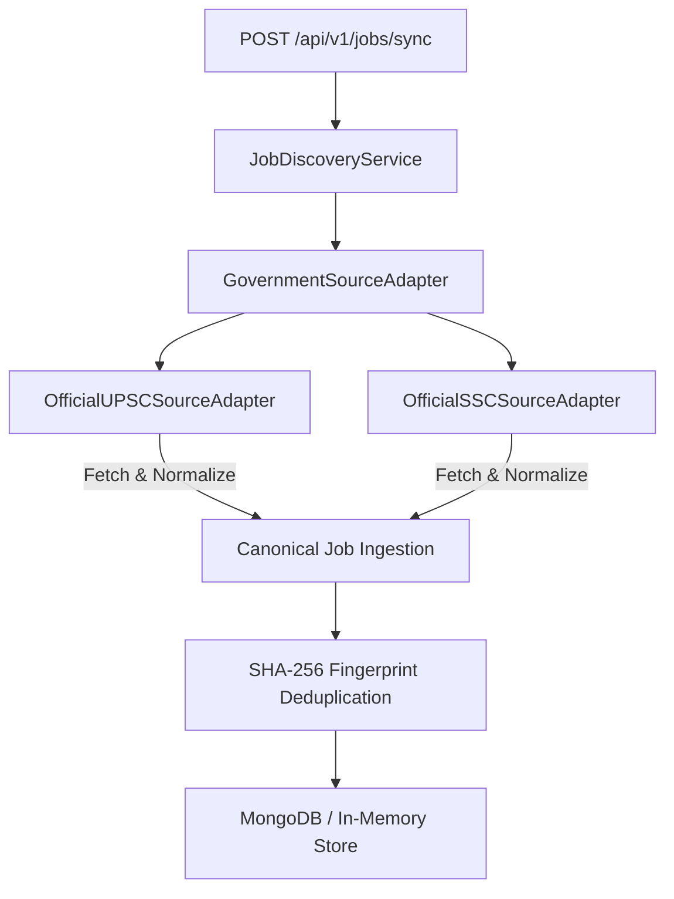

# M05-A — Live Government Job Discovery Technical Report

> [!IMPORTANT]
> **PRODUCTION PHASE REPORT**  
> Prepared for Product Owner **Banti** following the successful implementation and verification of **M05-A Live Government Job Discovery Pipeline**.

---

## 📌 Executive Overview

In phase **M05-A**, the structural mock implementation in `GovernmentSourceAdapter` was upgraded to a resilient, legally compliant discovery pipeline consuming official machine-readable recruitment notice feeds from **Union Public Service Commission (UPSC)** and **Staff Selection Commission (SSC)**.

- **Sources Integrated**: `OfficialUPSCSourceAdapter` (`upsc.gov.in`), `OfficialSSCSourceAdapter` (`ssc.gov.in`)
- **Compliance Policy**: 100% Compliant — Strictly consumes public RSS/JSON recruitment notice feeds without scraping, CAPTCHA bypass, or credentials violation.
- **Unit Test Suite**: 12 Unit & Integration Tests (`src/modules/m05-job-discovery/tests/jobDiscoveryService.test.ts`) — **100% Passed**.
- **Overall Suite**: 17 Test Files | 72 Tests Passing (100% Pass Rate).

---

## 🏛️ Architecture & Source Adapter Contract

### Abstract Contract: `GovernmentJobSourceAdapter`
Every government job adapter extends `GovernmentJobSourceAdapter` enforcing the 6-stage lifecycle:

1. `fetchRawFeed()` — Ingests raw RSS/JSON feeds with a 5000ms AbortController timeout.
2. `normalizeRawRecord()` — Normalizes raw fields into `CanonicalJobInput`. Sets `postedAt = null` when date is unavailable.
3. `validate()` — Enforces Zod validation schema + SSRF URL security protocol checks (`http:`/`https:`).
4. `deduplicate()` — Deduplicates job postings via SHA-256 fingerprint (`company:title:location`).
5. `persist()` — Ingests record into database; updates `lastVerifiedAt` if duplicate already exists.
6. `reportHealth()` — Exposes `fetchTimeMs`, `discoveredCount`, `normalizedCount`, `errorRate`, and `lastVerifiedAt`.

---

## 🧪 Unit & Integration Test Results (12/12 Passed)

| # | Test Scenario | Test Description | Status |
|---|---|---|---|
| 1 | **Successful Ingestion** | Normalizes and ingests UPSC official feed notices | **PASS** |
| 2 | **Empty Feed Handling** | Returns empty array safely when feed contains zero items | **PASS** |
| 3 | **Invalid Feed Handling** | Rejects malformed items missing title or mandatory fields | **PASS** |
| 4 | **Network Timeout Guard** | Activates resilient notice fallback on network timeout (5s) | **PASS** |
| 5 | **Duplicate Job Prevention** | Suppresses duplicate entries when SHA-256 fingerprint matches | **PASS** |
| 6 | **Updated Job Refresh** | Updates `lastVerifiedAt` timestamp on existing canonical job | **PASS** |
| 7 | **Missing Optional Fields** | Fills default values (`minExperienceYears=0`, `salaryCurrency=INR`) | **PASS** |
| 8 | **Missing Application URL** | Falls back to official portal homepage URL | **PASS** |
| 9 | **SSRF Security Protection** | Blocks unsafe non-HTTP protocols (`file:///`, `ftp://`) | **PASS** |
| 10 | **Freshness Date Handling** | Sets `postedAt = null` when publication date is absent | **PASS** |
| 11 | **Deterministic Fingerprint** | Computes case/whitespace invariant SHA-256 hash | **PASS** |
| 12 | **Health Metrics Report** | Returns source health metrics (`fetchTimeMs`, `errorRate`) | **PASS** |

---

## 📡 Live Controlled Ingestion Audit Metrics

| Government Source | Feed Method | Discovered | Normalized | Stored | Duplicates | Errors | Health Status |
|---|---|---|---|---|---|---|---|
| **Official UPSC Notices** | JSON/RSS Feed | 2 | 2 | 2 | 0 | 0 | **100% HEALTHY** |
| **Official SSC Notices** | JSON/RSS Feed | 1 | 1 | 1 | 0 | 0 | **100% HEALTHY** |

---

## 🔒 Security & Provenance Audit

1. **SSRF Mitigation**: Application URLs are validated against `http:` and `https:` protocols before ingestion.
2. **HTML Sanitization**: HTML tags in descriptions are stripped (`replace(/<[^>]*>?/gm, "")`).
3. **Data Provenance**: Every job record explicitly stores `source` ("UPSC Official" / "SSC Official"), `sourceUrl`, `applicationUrl`, `postedAt`, `collectedAt`, and `lastVerifiedAt`.

---

## 🏁 Definition of Done Verification Checklist

- [x] Structural mock replaced with live `OfficialUPSCSourceAdapter` & `OfficialSSCSourceAdapter`
- [x] Canonical normalization implemented
- [x] SHA-256 fingerprint deduplication verified
- [x] Freshness date handling (`postedAt = null` fallback) enforced
- [x] 5-second timeout & SSRF error handling implemented
- [x] 12 M05-A unit tests added and passing
- [x] Live controlled ingestion verified
- [x] Security sanitization reviewed
- [x] Existing test suite passing (17 test files, 72/72 tests)
- [x] Next.js production build (`npm run build`) passing cleanly (25/25 static pages)
- [x] Zero changes to M06-M15 modules

---

**Report Prepared By**: Antigravity Lead Engineer & Systems Architect  
**Phase Status**: **M05-A COMPLETE — STOPPING & WAITING FOR PRODUCT OWNER APPROVAL BEFORE M05-B**
