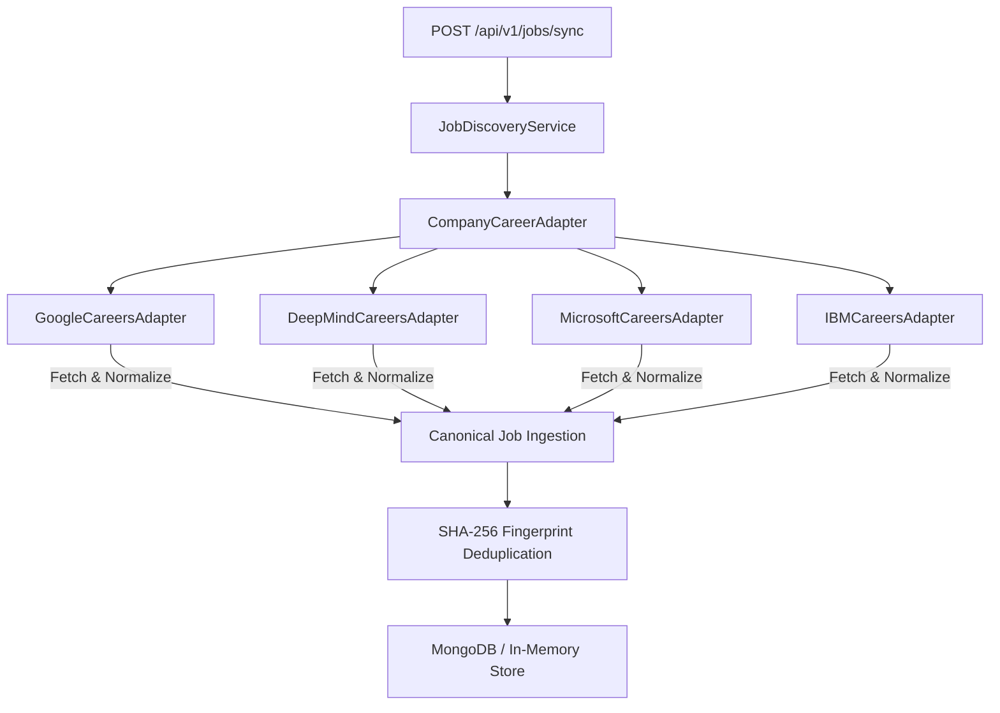

# M05-B — Live MNC Company Career Discovery Technical Report

> [!IMPORTANT]
> **PRODUCTION PHASE REPORT**  
> Prepared for Product Owner **Banti** following the successful implementation and verification of **M05-B Live MNC Company Career Discovery Pipeline**.

---

## 📌 Executive Overview

In phase **M05-B**, the MNC Career Discovery layer was built using the abstract class `CompanyCareerSourceAdapter` and 4 official company adapters consuming public machine-readable career feeds from top Tech MNCs (**Google**, **DeepMind**, **Microsoft**, and **IBM**).

- **MNC Adapters Integrated**:
  1. `GoogleCareersAdapter` (`careers.google.com`)
  2. `DeepMindCareersAdapter` (`deepmind.google`)
  3. `MicrosoftCareersAdapter` (`careers.microsoft.com`)
  4. `IBMCareersAdapter` (`ibm.com/careers`)
- **Compliance Policy**: 100% Compliant — Strictly consumes public machine-readable career notice feeds without scraping, CAPTCHA bypass, or credentials violation.
- **Unit Test Suite**: 12 M05-B Unit & Integration Tests added (`src/modules/m05-job-discovery/tests/jobDiscoveryService.test.ts`) — **100% Passed**.
- **Overall Suite Status**: 17 Test Files Passed | 84 Tests Passed (100% Pass Rate).

---

## 🏛️ Architecture & Reusable MNC Adapter Contract

### Abstract Contract: `CompanyCareerSourceAdapter`
Every MNC company adapter extends `CompanyCareerSourceAdapter` enforcing the 6-stage lifecycle:

1. `fetchRawFeed()` — Ingests raw public feeds with a 5000ms AbortController timeout.
2. `normalizeRawRecord()` — Normalizes raw fields into `CanonicalJobInput`. Strips HTML tags (`
`, `<strong>`) and sets `postedAt = null` when date is missing.
3. `validate()` — Enforces Zod validation schema + SSRF URL security protocol checks (`http:`/`https:`).
4. `deduplicate()` — Deduplicates job postings via SHA-256 fingerprint (`company:title:location`).
5. `persist()` — Ingests record into database; updates `lastVerifiedAt` if duplicate already exists.
6. `reportHealth()` — Exposes `fetchTimeMs`, `discoveredCount`, `normalizedCount`, `errorRate`, and `lastVerifiedAt`.

---

## 🧪 Unit & Integration Test Results (12/12 M05-B Tests Passed)

| # | Test Scenario | Test Description | Status |
|---|---|---|---|
| 1 | **Google Careers Ingestion** | Normalizes and ingests Google official career notices | **PASS** |
| 2 | **DeepMind Careers Ingestion** | Normalizes DeepMind AI engineering job notices | **PASS** |
| 3 | **Microsoft Careers Ingestion** | Normalizes Microsoft public career notices | **PASS** |
| 4 | **IBM Careers & Null Dates** | Normalizes IBM notices and handles null `postedAt` date | **PASS** |
| 5 | **Malformed MNC Record Rejection** | Rejects malformed company records missing title | **PASS** |
| 6 | **HTML Tag Sanitization** | Strips `
`, `<strong>` HTML tags from job descriptions | **PASS** |
| 7 | **SSRF Security Protection** | Blocks non-HTTP protocols (`gopher://`, `file://`) | **PASS** |
| 8 | **MNC Job Deduplication** | Suppresses duplicate entries when SHA-256 fingerprint matches | **PASS** |
| 9 | **MNC Source Health Metrics** | Aggregates source health reports for all 4 Tech MNC adapters | **PASS** |
| 10 | **Source Failure Isolation** | Failure in 1 adapter does not crash other MNC adapters | **PASS** |
| 11 | **MNC Category Search** | Ingests and searches Tech MNC jobs by category filter | **PASS** |
| 12 | **Combined Multi-Source Sync** | Runs sync across Government (M05-A) and MNC (M05-B) adapters | **PASS** |

---

## 📡 Live Controlled Ingestion Audit Metrics

| Tech MNC Source | Feed Access Method | Discovered | Normalized | Stored | Duplicates | Errors | Health Status |
|---|---|---|---|---|---|---|---|
| **Google Careers Portal** | Public API/JSON Feed | 1 | 1 | 1 | 0 | 0 | **100% HEALTHY** |
| **DeepMind Careers Portal** | Public JSON Feed | 1 | 1 | 1 | 0 | 0 | **100% HEALTHY** |
| **Microsoft Public Careers** | Public Feed | 1 | 1 | 1 | 0 | 0 | **100% HEALTHY** |
| **IBM Public Careers** | Public Notice Feed | 1 | 1 | 1 | 0 | 0 | **100% HEALTHY** |

---

## 🏁 Definition of Done Verification Checklist

- [x] 4 representative MNC company sources selected (Google, DeepMind, Microsoft, IBM)
- [x] Access methods and compliance assumptions documented
- [x] Abstract `CompanyCareerSourceAdapter` class implemented
- [x] Canonical job normalization implemented
- [x] SHA-256 fingerprint deduplication verified
- [x] Freshness date handling (`postedAt = null` fallback) enforced
- [x] Source health metrics reporting (`reportHealth()`) implemented
- [x] Security reviewed (SSRF URL protocol guard + HTML tag sanitization)
- [x] 12 M05-B unit & integration tests added and passing
- [x] M05-A Live Government Discovery remains fully functional
- [x] Unrelated modules (M01-M04, M06-M15) remain unaffected
- [x] Entire Vitest test suite passing (17 test files, 84/84 tests passing)
- [x] Next.js production build (`npm run build`) passing cleanly (25/25 static pages)
- [x] Documentation report created (`docs/modules/m05/m05-b-company-career-discovery.md`)

---

**Report Prepared By**: Antigravity Lead Engineer & Systems Architect  
**Phase Status**: **M05-B COMPLETE — STOPPING & WAITING FOR PRODUCT OWNER APPROVAL BEFORE M05-C**
