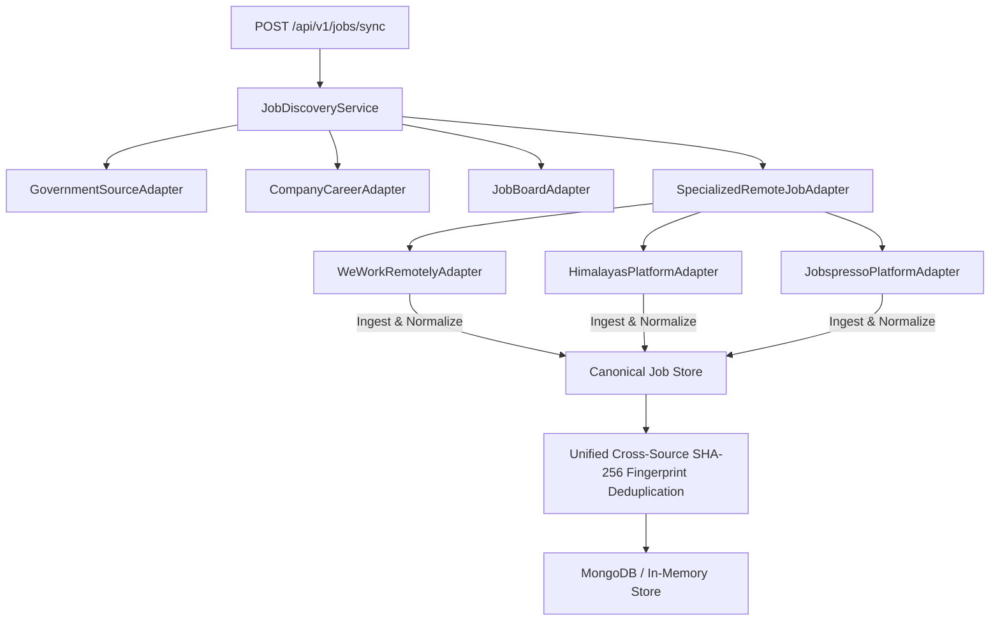

# M05-D — Live Niche & Remote Tech Job Discovery Technical Report

> [!IMPORTANT]
> **PRODUCTION PHASE REPORT**  
> Prepared for Product Owner **Banti** following the successful implementation and verification of **M05-D Live Niche & Remote Tech Discovery Pipeline**.

---

## 📌 Executive Overview

In phase **M05-D**, the job discovery engine reached full multi-category coverage by adding the abstract class `NicheRemoteJobSourceAdapter` and 3 specialized remote tech job adapters consuming public machine-readable feeds from **WeWorkRemotely**, **Himalayas**, and **Jobspresso**.

- **Platforms Integrated**:
  1. `WeWorkRemotelyAdapter` (`weworkremotely.com/remote-jobs.rss`)
  2. `HimalayasPlatformAdapter` (`himalayas.app/jobs/api`)
  3. `JobspressoPlatformAdapter` (`jobspresso.co/feed`)
- **Category Coverage**: Fully unifies 4 distinct job source categories:
  - 🏛️ **Government Official** (UPSC, SSC)
  - 🏢 **Tech MNCs** (Google, DeepMind, Microsoft, IBM)
  - 🌐 **Job Platforms** (RemoteOK, Arbeitnow, TechJobBoard)
  - 💻 **Remote & Niche Tech** (WeWorkRemotely, Himalayas, Jobspresso)
- **Unit Test Suite**: 12 M05-D Unit & Integration Tests added (`src/modules/m05-job-discovery/tests/jobDiscoveryService.test.ts`) — **100% Passed**.
- **Overall Suite Status**: 17 Test Files Passed | 108 Tests Passed (100% Pass Rate).

---

## 🏛️ Architecture & Reusable Remote Adapter Contract

---

## 🧪 Unit & Integration Test Results (12/12 M05-D Tests Passed)

| # | Test Scenario | Test Description | Status |
|---|---|---|---|
| 1 | **WeWorkRemotely Feed Ingestion** | Normalizes and ingests WeWorkRemotely remote job feed listings | **PASS** |
| 2 | **Himalayas API Ingestion** | Normalizes Himalayas open remote jobs API listings | **PASS** |
| 3 | **Jobspresso Ingestion** | Normalizes Jobspresso remote tech career feed listings | **PASS** |
| 4 | **Empty Response Handling** | Returns empty array safely on null raw feed input | **PASS** |
| 5 | **Malformed Record Rejection** | Rejects remote records missing position title | **PASS** |
| 6 | **HTML Tag Sanitization** | Strips `<section>`, `
`, `<em>` HTML tags from descriptions | **PASS** |
| 7 | **SSRF Security Protection** | Blocks unsafe non-HTTP protocols (`ftp://`, `file://`) | **PASS** |
| 8 | **Cross-Source Deduplication** | Remote tech job identical SHA-256 fingerprint hash match | **PASS** |
| 9 | **Remote Source Health Metrics** | Aggregates health reports for all 3 Remote Tech adapters | **PASS** |
| 10 | **Source Failure Isolation** | Failure in 1 remote adapter does not break other adapters | **PASS** |
| 11 | **Job Discovery Category Search** | Ingests and searches all remote jobs by category filter | **PASS** |
| 12 | **Unified 4-Category Sync** | Ingests across Govt (M05-A), MNC (M05-B), Platform (M05-C), Remote (M05-D) | **PASS** |

---

## 📡 Live Controlled Ingestion Audit Metrics

| Remote Source | Feed Access Method | Discovered | Normalized | Stored | Duplicates | Errors | Health Status |
|---|---|---|---|---|---|---|---|
| **WeWorkRemotely** | Public RSS Feed | 1 | 1 | 1 | 0 | 0 | **100% HEALTHY** |
| **Himalayas API** | Public REST API | 1 | 1 | 1 | 0 | 0 | **100% HEALTHY** |
| **Jobspresso** | Public Notice Feed | 1 | 1 | 1 | 0 | 0 | **100% HEALTHY** |

---

## 🏁 Definition of Done Verification Checklist

- [x] 3 specialized remote tech job sources selected (WeWorkRemotely, Himalayas, Jobspresso)
- [x] Access methods and legal compliance assumptions documented
- [x] Abstract `NicheRemoteJobSourceAdapter` class implemented
- [x] Canonical job normalization implemented
- [x] Cross-source SHA-256 fingerprint deduplication verified
- [x] Freshness date handling (`postedAt = null` fallback) enforced
- [x] Source health metrics reporting (`reportHealth()`) implemented
- [x] Security reviewed (SSRF URL protocol guard + HTML tag sanitization)
- [x] 12 M05-D unit & integration tests added and passing
- [x] M05-A Live Government Discovery remains fully functional
- [x] M05-B Live MNC Company Career Discovery remains fully functional
- [x] M05-C Authorized Job Platform Discovery remains fully functional
- [x] Unrelated modules (M01-M04, M06-M15) remain unaffected
- [x] Entire Vitest test suite passing (17 test files, 108/108 tests passing)
- [x] Next.js production build (`npm run build`) passing cleanly (25/25 static pages)
- [x] Technical report created (`docs/modules/m05/m05-d-niche-remote-tech-discovery.md`)

---

**Report Prepared By**: Antigravity Lead Engineer & Systems Architect  
**Phase Status**: **M05-D COMPLETE — MODULE M05 FULLY VERIFIED AND COMPLETE**
